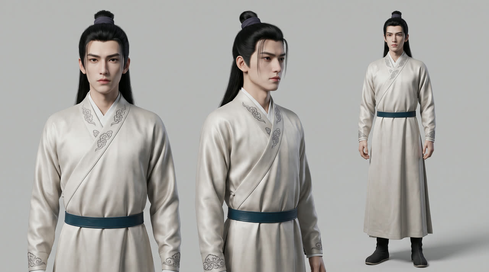
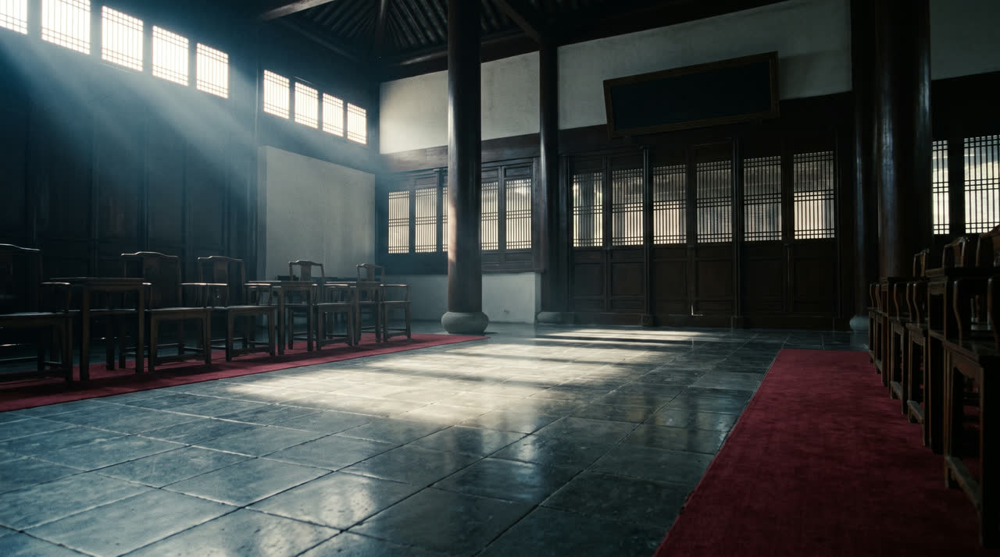
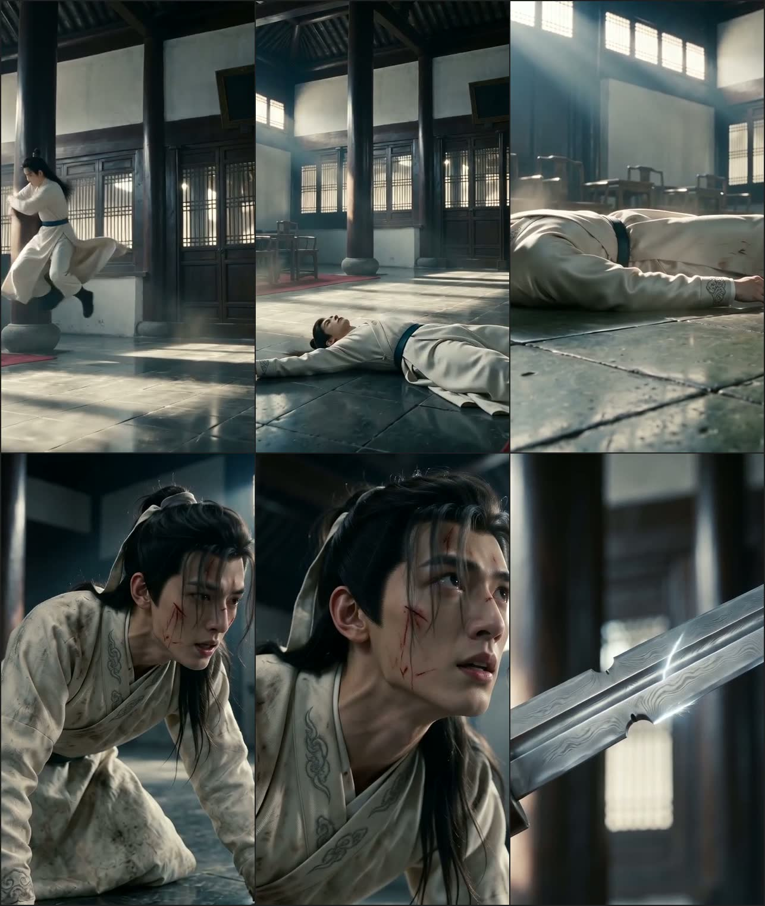

# Story-to-Video Pipeline · 影视制作流水线（复用层 · 短剧 / 影视 / 动漫通用）

**English**：A reusable AI video production pipeline — from a script or novel to a finished, publishable cut. Covers short dramas, TV/web series, film, animation and anime with the same 13-step workflow; the reusable layer (rules, tools, docs, orchestration skill) is installed once and shared by every project.

> **本仓库是复用层，不含任何具体剧本的数据。** 规则、脚本、通用文档、编排 skill 装一次，**所有内容形态共用**——短剧、网剧、影视、动画、动漫、漫剧走的是同一条工序链，差别只在题材、画风与时长参数（都在项目层的 `meta.theme` 与 `meta.inputs_from_author` 里）。
> 项目实例在 [`projects/`](projects/) 下各自独立；**项目状态只写在项目自己的 `README.md` 里。**
> 这份文件是**总清单**：用了什么系统、什么版本、什么依赖、什么组件、什么 skill，每一步分别干什么。

## 优势速览：做了什么 · 解决了什么痛点

**定位**：把「一堆 AI 生成的片段」串成能交付的成片——**状态只存在文件里，卡点全由脚本判定**。

**做了哪些**：

| 做了 | 规模 |
|---|---|
| 工序链 | N0–N12 共 13 道，关键路径 N0 → N1 → N6 → N7 → N8 → N10 → N11 → N12 |
| 验收关 | G0–G7 共 8 道，其中 3 处**停机等作者**（定妆关 / 过片抽查 / 定剪通看）；批量生成前的积分预算、未决问题同样要停 |
| 自动校验 | `tools/check_consistency.py` 的 R0–R21，0 错误才放行；`--delivery` 另审交付完整性 |
| 规则库 | 5 类 50 条硬/软阈值：COMP 12 · ME 10 · PH 11 · VD 6 · FF 11 |
| 脚本 | `tools/` 7 个，纯标准库、零第三方依赖 |
| 场记台账 | 每项目 `schema/` 四件套（`shots.csv` 48 列，从中文提示词一直记到 QA 十项） |
| 文档与 skill | `docs/` 九篇（01–06、08–10；07 属项目层）、`rules/` 五篇、编排 skill `story-to-video` |
| 复用方式 | 复用层（本仓库）与项目层（`projects/<项目名>/`）分离：短剧 / 网剧 / 影视 / 动画 / 漫剧共用同一条工序链，差别只在题材与时长参数 |

**解决了什么痛点**：

| 痛点 | 通常怎么翻车 | 这套怎么做 |
|---|---|---|
| 角色 / 场景 / 风格漂移 | 每条镜头各自生成，人物脸和场景越走越远 | **资产先于镜头**：定妆图三视图、场景空镜、风格锚图先定稿再分镜；锚点带 `sha256` 入台账，每镜挂同一套参考图 |
| 一换会话就失忆 | 状态存在对话里，重开就重来，交接就断片 | 状态只从磁盘 `schema/` 读，任何一次重开都接得上 |
| 物理与表演假 | 悬浮、匀速漂移、脸部微表情崩坏 | `rules/PH` 11 条与 `rules/ME` 10 条把实测阈值写成硬约束（含帧差测量方法），不是「看着还行」 |
| 台词超镜头、字幕对不上 | 到剪辑才发现，只能返工 | N7 写分镜时就算台词预算，N9 用**实测音频时长**回填，R8 / R16 拦 |
| 剪辑工具链踩坑 | 普通 ffmpeg 没有字幕滤镜，一条命令白干 | 强制 `ffmpeg-full` + `rules/FF` 11 条：响度、转场、字幕，单镜时长不得改 |
| 积分烧穿 | 档位不匹配、模型越档、反复重生成 | [docs/10](docs/10-account-plans-and-credits.md) 写清档位门槛与单价 + 预算；R21 拦模型越档；不合格重生成有判据 |
| 上下文被素材撑爆 | 4–9MB 的图直接进上下文，请求被网关 413 | `tools/eye.py` 先把任意素材压到 ≤300KB JPEG 再看 |
| 交付没凭据 | 换人接手只能口口相传 | 台账 + 验收关 + 归档包 + git tag，解压后能重新校验通过 |

**一句话优势**：可中断、可交接、可回溯、成本可算——「这一步做完没有」由脚本回答，不由记忆回答。

**示例产出**（来自示例项目 [`projects/zhuangyuan-ep01`](projects/zhuangyuan-ep01/)，点图看大图）：

| 角色定妆图（三视图） | 场景空镜（镇北侯府·厅堂） |
|---|---|
|  |  |
| **风格锚图**（材质板，统一全片调性） | **成片截帧**（9:16 分发版 demo） |
|  |  |

**G2 定妆关评审拼图**（4 张资产一次过目——人工验收关就停在这里，等作者拍板）：


> 这 5 张是 `tools/eye.py` 压到 ≤300KB 的看图版（共 724KB）；4–9MB 的原始 PNG 留在 `project/work/`，不入库。

---

## 一、系统环境（本机实测，2026-09-16）

| 项 | 值 |
|---|---|
| 操作系统 | macOS 15.7.5（Build 24G624） |
| 架构 | arm64（Apple Silicon） |
| 包管理 | Homebrew（`/opt/homebrew`） |
| Node 版本管理 | fnm（`~/.local/share/fnm`） |
| 工作目录 | `~/work/个人文档/v-pr/`（本仓库 `影视制作流水线/` + 项目实例 + 第三方 skill 源码） |
| 凭证目录 | `~/.config/higgsfield/`（唯一凭证，无任何 apikey） |
| Agent | Codex（skill 目录 `~/.codex/skills/`）；Claude Code 亦可（`~/.claude/skills/`） |

---

## 二、依赖与 CLI 清单

### 2.1 系统二进制

| 依赖 | 实测版本 | 路径 | 干什么 | 安装 | 验证 |
|---|---|---|---|---|---|
| `python3` | 3.14.6 | `/opt/homebrew/bin/python3` | 本仓库全部脚本（场记核对、脚手架、字幕、回填、看图限流） | `brew install python@3` | `python3 -V` |
| `node` | v25.9.0 | fnm 管理 | 跑 `shuohao-skills` 五件套的 `.mjs` 脚本（要求 ≥18） | `fnm install --lts` | `node -v` |
| `npx` | 11.19.1 | 随 node | 安装 `ffmpeg-skill` | — | `npx --version` |
| `jq` | 1.8.2 | `/opt/homebrew/bin/jq` | 查 `schema/*.json`（确认项目参数、抽查字段） | `brew install jq` | `jq --version` |
| `git` | 2.39.5（Apple Git-154） | `/usr/bin/git` | `schema/` 与文档的版本管理、rename 追踪 | `xcode-select --install` | `git --version` |
| `magick`（ImageMagick） | 7.1.2-27 Q16-HDRI aarch64 | `/opt/homebrew/bin/magick` | 图片规格统一、拼版、帧差测量（rules/ME 的测量方法用它） | `brew install imagemagick` | `magick -version` |
| `tar` | 系统自带 | `/usr/bin/tar` | 归档包 `archive_<PROJECT>_<YYYYMMDD>.tar.gz` | — | `tar --version` |
| `shasum` | 系统自带 | `/usr/bin/shasum` | 剧本指纹、资产哈希（`assets.json.sha256`） | — | `shasum -a 256 <文件>` |

### 2.2 ffmpeg：必须装两个（只有 `ffmpeg-full` 能干字幕的活）

| 二进制 | 实测版本 | 路径 | 能力 | 干什么 |
|---|---|---|---|---|
| `ffmpeg` / `ffprobe` | 9.0.1 | `/opt/homebrew/bin/` | **无** libass / freetype / vidstab | 规格核对（`ffprobe`）、基础拼接与转码 |
| `ffmpeg-full` | 9.0.1 | `/opt/homebrew/opt/ffmpeg-full/bin/` | **有** `subtitles` / `drawtext` / `vidstabdetect` | 字幕烧录、文字叠加、防抖、带时间码的 QA 拼图 |

```bash
brew install ffmpeg ffmpeg-full          # keg-only，互不覆盖
export PATH="/opt/homebrew/opt/ffmpeg-full/bin:$PATH"   # 每次调用前，必须（FF-001）
ffmpeg -hide_banner -filters | grep -E "subtitles|drawtext"   # 两条都要有输出
```

失败信号：`No such filter: 'drawtext'` / `'subtitles'` → PATH 没生效（`ffmpeg-skill` 用 `shutil.which("ffmpeg")` 找二进制）。

### 2.3 higgsfield CLI 与账号（唯一的付费依赖）

| 项 | 值 |
|---|---|
| 版本 | 1.1.25（build 2026-09-14） |
| 路径 | `/usr/local/bin/higgsfield` |
| 安装 | `curl -fsSL https://raw.githubusercontent.com/higgsfield-ai/cli/main/install.sh \| sh` |
| 登录 | `higgsfield auth login`（设备码 → 浏览器授权），凭证落 `~/.config/higgsfield/credentials.json`（600） |
| 账号状态 | 已登录；**basic 套餐**（余额随时变，一律以 `higgsfield account status` 为准，不写死在文档里） |
| 模型场记台账 | `higgsfield model list`（文档会滞后；实测出图真名是 `nano_banana_pro`） |

> **档位门槛、月费与积分账单单独成文** → [docs/10 账号、权限与积分门槛](docs/10-account-plans-and-credits.md)：
> 四档价位与权限矩阵（Basic $9/120 积分 · Pro $23/600 · Max $165/5400 · Team $65/座起）、哪些能力要什么档位（Soul 训练需付费档；**Basic 没有完整的 Seedance 2.0 与 2.5**）、每个动作的积分单价、一集与全剧的积分预算。

**它承担的活**：出图（**场景首选 `soul_location` 0.12 积分/张**；通用与带参考图的编辑用 `nano_banana_pro` 2 积分/张）、出视频（**单价与可用模型取决于档位**：Basic 只有 `seedance_2_0 --mode fast`（3.5 积分/秒，限 480p/720p）与 `seedance_2_0_mini`（2.5/秒）；完整 2.0 std（4.5/秒）与 2.5 需 Pro）、配音（`text2speech_v2` 0.1 积分/句）、横转竖（`generate workflow reframe` ≈9.3 积分/秒——**默认改用 ffmpeg 裁切**）。

**本项目不用**：`soul-id`（真人脸训练需 Basic 以上，改走定妆图三视图）、`generate workflow dubbing`（纯中文不出海）。

---

## 三、Skills 清单

### 3.1 本仓库自带（`skills/`，软链到 `~/.codex/skills/`）

| Skill | 版本 | 干什么 | 用在哪一步 |
|---|---|---|---|
| `story-to-video` | 1.0.0 | **编排层**：丢进剧本就按 N0–N12 走，管验收关、停机待审、状态记入台账；不复制规则 | 全程 |

### 3.2 外部安装（源码在仓库外，软链进 `~/.codex/skills/` 或 `~/.agents/skills/`）

| Skill | 版本 / 来源 | 干什么 | 用在哪一步 |
|---|---|---|---|
| `novel-outline` | 1.2.0 · [shuohao-skills](https://github.com/eternityspring/shuohao-skills)（Apache-2.0） | 小说 → 大纲五件套（改编说明 / 人物表 / 爽点表 / 分集梗概 / 资产清单），14 道脚本质量门 | N1 题材时代、N4 分集 |
| `novel-characters` | 1.11.0 · 同上 | 角色设定集：画像、形象提示词、**音色提示词**、角色设定图 | N2 人物服装、N5 音色、N6 定妆图 |
| `novel-art` | 1.2.0 · 同上 | 美术设定集：场景 + 叙事道具的一致性锚点、光照变体、白底提示词，11 道质量门 | N3 场景物件、N6 参考图 |
| `novel-script` | 1.2.0 · 同上 | 剧本：场次 + 节拍流，**逐集时长按语速折算**，钩子前 3 拍兑现，台词本带音色，10 道质量门 | N7 台词与预算 |
| `novel-storyboard` | 1.3.0 · 同上 | 分镜三层：段（≤15s）→ 分镜（2–5s 硬门）→ 分镜图；H3 提示词逐字对账，17 道质量门 | N7 分镜、N8 关键帧 |
| `ffmpeg-skill` | 1.17.3 · `kajisho5/ffmpeg-skill`（MIT，42 个工具） | **所有剪辑与交付**：裁剪、拼接、横转竖、字幕、响度、合规检查、QA 看图 | N11 剪辑、N12 交付 |
| `seedance`（seedance-prompt-skill） | `MapleShaw/seedance2.0-prompt-skill`（MIT） | 运镜四维编码 Z/Y/X/F、25 格流水线、六套剪辑公式 | N7 分镜、N11 节奏 |
| `higgsfield-generate`（同仓库共 9 个 skill） | 0.12.0 · [higgsfield-skills](https://github.com/higgsfield-ai/skills) | 出图 / 出视频 / 出音频，30+ 模型统一入口（`soul_location`、`nano_banana_pro`、`seedance_2_0`…） | N6 参考图、N8 关键帧、N9 配音 |

装法（上面几个仓库各装一次；走软链装的，之后 `git pull` 即生效）：

```bash
# shuohao-skills：短剧前段五件套（novel-*），自带脚本软链进 agent 的 skills 目录
git clone https://github.com/eternityspring/shuohao-skills.git && cd shuohao-skills && ./scripts/install.sh

# higgsfield 官方 9 个 skill（含 higgsfield-generate）；顺带装好 CLI，装完跑 higgsfield auth login
npx skills add higgsfield-ai/skills       # 等价：gh skill install higgsfield-ai/skills

# seedance / ffmpeg：源码留在仓库外，软链复用，避免分叉
ln -s <seedance 仓库根> ~/.agents/skills/seedance-prompt-skill
npx ffmpeg-skill --codex            # → ~/.agents/skills/ffmpeg-skill

# 本仓库自带的编排 skill
ln -s <本仓库根>/skills/story-to-video ~/.codex/skills/story-to-video

ls ~/.codex/skills ~/.agents/skills | grep -E "novel-|higgsfield-|ffmpeg-skill|seedance"   # 验证
# higgsfield 自检：在 agent 里说「用 higgsfield 出一张最小测试图」，它应调 higgsfield-generate 并返回图片 URL
```

本机实际位置：`higgsfield-skills/`、`shuohao-skills/`、`seedance-prompt-skill/` 都在仓库的上一级 `~/work/个人文档/v-pr/`，`ffmpeg-skill` 直接装在 `~/.agents/skills/`。逐条的验证命令与登录态排查见 [docs/09](docs/09-toolchain-setup.md)。

### 3.3 Codex 内置（按需）

| Skill | 干什么 | 用在哪一步 |
|---|---|---|
| `imagegen` | 位图生成与编辑（`novel-*` 出设定图也走它） | N6 资产定稿 |
| `spreadsheets` / `excel-xlsx` | 资产清单、分镜表导出 XLSX | N12 交付 |
| `visualize` | 节奏曲线、时间线可视化 | N7 / N11 |

### 3.4 明确不装

| Skill | 原因 |
|---|---|
| `higgsfield-soul-id` | 需 Basic 以上套餐，本项目走定妆图三视图 |
| `higgsfield-video-explainer` / `brandkit` / `product-photoshoot` / `marketplace-cards` | 解说片与电商向，短剧不需要 |
| `create-storyboard-skill` / `cinematic-storyboard-skill` / `h3-storyboard-skill` | 分镜统一走 `novel-storyboard`，不再装同类 |

---

## 四、组件清单（仓库里有什么）

| 组件 | 路径 | 是什么 | 谁写 |
|---|---|---|---|
| 规则库 | `rules/` | 与剧本、模型无关的硬约束：`COMP`（成片核心要素 12 项）、`ME`（表演与微表情 10 条）、`PH`（物理与动作 11 条）、`VD`（配音与字幕 6 条）、`FF`（剪辑与交付 11 条）；阈值分 `[硬]` / `[软]` | 人 |
| 通用文档 | `docs/01–06`、`docs/08–10` | 01 阶段说明、02 一致性控制、03 依赖与凭证、04 风险与验收关、05 运行与编排、06 连贯性与物理检查清单、08 工序依赖总图、09 工具链安装登录注册、10 账号档位与积分 | 人 |
| 脚本 | `tools/` | 见下方脚本清单 | 人 / Codex |
| 骨架模板 | `templates/schema/` | 新项目 `schema/` 的骨架（CSV 表头 + JSON 空结构），`bootstrap.py` 的唯一来源 | 人 |
| 项目实例 | `projects/<项目名>/` | 每个剧本一套：`schema/`（场记台账）、`project/`（素材）、`docs/07`（实测记录）、`README.md`（状态） | Codex |
| 凭证 | `~/.config/higgsfield/` | Higgsfield 登录态；按密钥对待 | 你 |

### 脚本清单

| 脚本 | 干什么 | 典型命令 |
|---|---|---|
| `tools/bootstrap.py` | **入口**：`--doctor` 体检工具链 / 登录 / skills；给剧本则铺出项目骨架（入库 + 指纹 + 空 schema） | `python3 tools/bootstrap.py --doctor`<br>`python3 tools/bootstrap.py 剧本.txt` |
| `tools/check_consistency.py` | **验收关**：引用完整性、编号规范、台词预算、字幕对齐、QA 十项等 R0–R21，零依赖 | `python3 tools/check_consistency.py --schema-dir <项目>/schema` |
| `tools/_project.py` | 项目定位：显式路径 > `projects/` 下唯一项目 > 报错列候选 | 被上面几个脚本 import |
| `tools/make_srt.py` | `shots.csv` → SRT（时间轴跟实测音频，单行 ≤20 字折行） | `python3 tools/make_srt.py` |
| `tools/tts_batch.py` | 按 `shots.csv` 台词 + `assets.json` 音色批量 TTS，回填 `audio_duration_s` | `python3 tools/tts_batch.py --dry-run` |
| `tools/record_shot.py` | 把一次生成的结果（`job_id` / `clip_file` / `qa_*`）回填到指定镜头行 | `python3 tools/record_shot.py --shot EP01-… --set status=done` |
| `tools/eye.py` | **看图限流器**：任何素材 → ≤300KB JPEG，防上下文 413 | `python3 tools/eye.py <图或视频> --tiles 3x2` |

### 每个项目的 `schema/` 四件套（场记台账）

| 文件 | 内容 | 谁填 |
|---|---|---|
| `story_bible.json` | `meta`（项目名 / 指纹 / 画幅 / **题材与时代** / 作者指定参数）、`characters[]`、`props[]`、`environments[]`、`styles[]`、`wardrobe[]`、`timeline[]`、`plot_beats[]`、`episode_plan[]`、`open_questions[]` | N1–N4 |
| `assets.json` | `assets[]`（定妆图 / 场景图 / 风格锚 + `anchor_file` + `sha256` + `job_id`）、`voices[]`（`VC-###` 音色绑定） | N5 / N6 |
| `episodes.csv` | 集 → 场次 → 镜头 三级索引 + 剧本映射 + 预估时长 | N7 |
| `shots.csv` | 分镜表（48 列：时长 / 姿态 / 位置 / 视线 / 道具 / 物理 / 提示词 / 参考资产 / `job_id` / QA 十项 / 版本） | N7–N10 |

---

## 五、每一步干什么（N0 → N12）

阶段代号 S0–S7 是粗粒度，工序 N0–N12 是执行粒度（S1 拆成 N1–N4，S5 拆成 N5 与 N9）。

| 工序 | 属于 | 输入 | 干什么 | 用什么 | 产出（记入台账） | 验收关 / 停机待审 |
|---|---|---|---|---|---|---|
| **N0** 初始化 | S0 | 剧本 txt + 作者参数（画幅 / 平台 / 语言 / 总集数） | 剧本入库（只读）、推项目名、算 sha256 指纹、建 `project/work` 五个目录、生成空 `schema/` | `tools/bootstrap.py`、`shasum` | 项目目录 + `meta.script_sha256` | **G0 筹备关**：`--draft` 0 错误 |
| **N1** 题材与时代 | S1 | 剧本全文 | 判定题材、时代、是否跨时代、服装考据方向、语体，每条附剧本原文出处 | skill `novel-outline` + 模型推理 | `meta.theme` | 场记核对 **R13** |
| **N2** 人物与服装 | S1 | 剧本 + `meta.theme` | 抽人物、写 3–6 条**可被图像检验**的外观锚点、标 `asset_level`（full / silhouette / none）与 `voice_need`；拆服装造型 `WD-###` | skill `novel-characters` | `characters[]`、`wardrobe[]` | **G1 剧本过会** |
| **N3** 场景与物件 | S1 | 剧本 + `meta.theme` | 抽场景（含 `time_of_day` 与光照方向）、道具（含尺度与状态变体） | skill `novel-art` | `environments[]`、`props[]` | **G1 剧本过会** |
| **N4** 剧情节点与分集 | S1 | 剧本全文 | 标钩子 / 转折 / 高潮 / 结尾，排时间线，推导集数与单集时长并写明依据 | skill `novel-outline` | `plot_beats[]`、`timeline[]`、`episode_plan` | **G1 剧本过会** |
| **N5** 音色选型绑定 | S5 前段 | `voice_need` | 列候选音色 → **同一句台词海选试听** → 定稿，一角色一 `VC-###`，回填 `voice_id` | `higgsfield voices list` + skill `novel-characters` 的音色提示词 | `assets.json.voices[]` | **R15**、VD-001 / VD-005 |
| **N6** 资产定稿出图 | S2 | 实体锚点 + `meta.theme` | 角色出定妆图三视图（剪影级只出一张逆光剪影；可选补 3/4 侧与略仰，见 docs/02 第七节）、场景出无人物空镜（**首选 `soul_location`**）、出一张风格锚图；逐张对锚点比对，不合格重生成 | `higgsfield generate create soul_location` / `nano_banana_pro`（+ `imagegen`） | `project/work/assets/*`、`assets.json.assets[]` | **G2 定妆关**（人工验收）（作者过目定稿） |
| **N7** 分集与分镜 | S3 | `episode_plan` + 已定稿资产 + 音色 | 拆场次 → 拆镜头（一镜一主节拍），填齐时长 / 景别 / 姿态 / 位置 / 视线 / 道具 / 物理 / 中心安全区 / 中文提示词，并**在写作时**算台词预算 | skill `novel-script`（台词与语速）+ `novel-storyboard`（段/分镜）+ `seedance`（运镜编码）+ docs/02 | `episodes.csv`、`shots.csv` | **G3 分镜关**（R14 台词预算、R17 分集自洽、R18 景别节奏、R19 风格锚、R20 姿态衔接） |
| **N8** 视频生成 | S4 | `shots.csv` 的 `todo` 行 + 参考资产 | 先出关键帧（首帧，关键镜加尾帧），再挂参考图生成视频；**参数按档位给**（Basic：`seedance_2_0 --mode fast` 限 720p，或 `seedance_2_0_mini`）；逐镜做视觉十项 QA，不合格重生成 | `higgsfield generate create seedance_2_0` + `tools/eye.py` + `tools/record_shot.py` | `keyframes/`、`clips/`、`job_id`、`qa_*` | **G4 过片关**（十项全 `pass`）+ **作者抽查 3–5 镜**；模型越档由 **R21** 拦 |
| **N9** 配音执行 | S5 后段 | 台词 + `voices[]` | 逐句 TTS，量出真实时长回填；台词长于镜头直接报错 | `tools/tts_batch.py` + `higgsfield generate create text2speech_v2` | `project/work/audio/*.mp3`、`audio_duration_s` | **G5 配音关**（R8 音频不超镜头） |
| **N10** 字幕 | S6 前段 | 镜头顺序 + 台词 + 实测音频 | 生成 SRT（跟真实音频、单行 ≤20 字折行） | `tools/make_srt.py` | `project/work/edit/EP**.srt` | **R16**（字幕逐条对齐分镜） |
| **N11** 剪辑与成片 | S6 | 片段 + 音频 + 字幕 | 拼接 → 转场 → 统一调色 → 混音（台词 > 环境音 > BGM）→ 字幕 → 出 16:9 母版与 9:16 分发版；**不得改变单镜时长** | skill `ffmpeg-skill` + `ffmpeg-full` + rules/FF | `EP**_16x9_v001.mp4`、`EP**_9x16_v001.mp4` | **G6 定剪关**（`check.py --platform tiktok` 0 failed + 看图）+ **作者通看** |
| **N12** 交付归档 | S7 | 成片 + 字幕 + 封面 + `schema/` | 命名归档、出横竖封面、导出资产清单（项目 / 系列 / 通用三档）、打归档包与 git tag | skill `imagegen` / `higgsfield-youtube-thumbnail`、`tar`、`git tag` | `project/delivery/*`、`archive_*.tar.gz` | **G7 交片关**（解压后能重新校验通过） |

**并行关系**：N1–N4 三路可并行；N5 与 N6 可并行；N9 不等 N8。
**关键路径**：N0 → N1 → N6 → N7 → N8 → N10 → N11 → N12。

---

## 六、这套流水线解决什么

输入一份剧本 txt，输出一部可以直接发布的短剧成片，并保证**人物、物体、建筑、场景、风格**五类信息在「结构化 → 分集 → 分镜 → 生视频 → 剪辑 → 配音」每一步都不跑偏。

跑偏的根因只有一个：**状态存在对话里，不存在文件里**。两条铁律：

1. **以场记台账为准**：任何阶段、任何一次重开对话，都只从磁盘上的 `schema/` 读状态，不靠上下文记忆。
2. **资产先于镜头**：角色定妆图、场景参考图、风格锚图没定稿之前，不允许进入分镜生视频。

### 关于 16:9 上抖音

抖音主流是 9:16 竖屏全屏；16:9 横屏在信息流里会被留黑边或缩成小窗，完播率通常更差。所以：**16:9 作制作母版，9:16 作分发版**。

| 版本 | 用途 | 怎么来 |
|---|---|---|
| 16:9 母版 | 保底、复用、二次剪辑、其他平台 | N11 直接产出 |
| 9:16 分发版 | 抖音主发 | `higgsfield generate workflow reframe`，或剪辑时按安全区裁切 |

代价是横转竖会裁掉两侧，所以 **N7 分镜阶段就要按「中心安全区」构图**（横向保留中间约 56%）：主体、关键道具、字幕都放中央，两侧只放可牺牲的环境信息。规则见 [docs/02](docs/02-consistency-control.md)。

---

## 七、目录结构

```
story-to-video-pipeline/                        ← 复用层：不含任何具体剧本的数据
├── README.md                      本文件（总清单）
├── skills/
│   └── story-to-video/      编排 skill（软链到 ~/.codex/skills/）
├── docs/                          通用文档 01–06 / 08 / 09 / 10（项目实测记录在项目自己的 docs/07）
├── rules/                         规则库：COMP / ME / PH / VD / FF
├── tools/                         脚本：bootstrap / check_consistency / make_srt / tts_batch / record_shot / eye / _project
├── templates/schema/              新项目骨架（bootstrap 的唯一来源）
└── projects/                      项目实例区（-o 也可指向仓库外）
    └── <项目名>/
        ├── README.md              项目状态写这里
        ├── schema/                场记台账：story_bible / assets / episodes / shots
        ├── docs/07-project-calibration-notes.md
        └── project/{raw,work,delivery}/
```

**为什么不把 rules / tools 复制进项目**：复制就是分叉，两处必然对不上。项目只带 `schema/` + `project/` + 自己的 README 与实测记录。

---

## 八、快速开始

```bash
# 1. 体检：工具装齐没有、CLI 登录没有、skills 在不在（缺什么它会告诉你装什么）
python3 tools/bootstrap.py --doctor

# 2. 丢一份剧本，铺出一个独立项目（默认落 projects/<项目名>/，也可 -o 放仓库外）
python3 tools/bootstrap.py 剧本.txt

# 3. 剩下的交给编排 skill：说一句「按 story-to-video 跑」
#    N1 → N12 逐工序推进，每步记入台账 schema/ 并跑场记核对，三处人工验收关停下等你

# 4. 任何时候都能查状态（状态只在项目自己的 schema/ 里）
python3 tools/check_consistency.py --schema-dir projects/<项目名>/schema
python3 tools/check_consistency.py --selftest      # 验证场记核对本身没坏
```

环境的安装 / 注册 / 登录 / 验证（换机 30 秒清单）见 [docs/09](docs/09-toolchain-setup.md)；工序依赖总图与验收关定义见 [docs/08](docs/08-pipeline-overview.md) 与 [docs/04](docs/04-risks-and-verification-gates.md)。

---

## 九、维护约定

| 要改什么 | 改哪里 | 注意 |
|---|---|---|
| 加一条通用规则 | `rules/<前缀>-*.md` | 必须带依据（实测数据 / 物理常数 / 可查证实测），并尽量落进场记核对 |
| 加一条可自动检查的约束 | `tools/check_consistency.py` | 同时补 `--selftest` 负例，否则等于没加 |
| 改 schema 列 | `templates/schema/` + 现有项目的 `schema/` | 列数变化会被 R0 抓到；两处都要改，别只改一处 |
| 加一个项目 | `python3 tools/bootstrap.py 剧本.txt` | 不要复制本仓库任何目录 |
| 升级模型 / 参数 | 不改文档，先跑 `higgsfield model list` | 文档会滞后，CLI 输出为准 |
| 升级依赖 | 见 [docs/09](docs/09-toolchain-setup.md) | 版本变化后重跑 `--doctor` 与 `--selftest` |

---

## 十、术语对照（影视行话 ↔ 仓库里的文件 / 工具）

流程描述一律用影视行话；**文件名与命令保持原样**（那是工具的实际名字）。两边对照如下：

| 影视行话（文档里这么写） | 对应的文件 / 工具 | 说明 |
|---|---|---|
| **场记台账** | `schema/`：`story_bible.json`、`assets.json`、`episodes.csv`、`shots.csv` | 现场**唯一记录**。任何阶段、任何一次重开对话，只认它，不认记忆 |
| **场记核对**（连戏检查） | `tools/check_consistency.py`（规则 R0–R21） | 自动查引用、编号、台词时长预算、字幕对齐、连戏与道具一致 |
| **验收关** | 阶段落点 G0–G7 | 八道关：**筹备关 · 剧本过会 · 定妆关 · 分镜关 · 过片关 · 配音关 · 定剪关 · 交片关**。哪一关不过，不进下一道工序 |
| **停机待审** | 流程要求（无文件对应） | 必须停下来等作者/导演点头的地方：定妆定稿、过片抽查、定剪通看、批量开拍前报预算、未决问题 |
| **记入台账** | 写入 `schema/` 下的文件 | 每道工序干完就写一次，写一次跑一次场记核对 |
| **工序** | 流程编号 N0–N12 | 从「丢进剧本」到「交片」拆出的 13 道工序 |
| **过片** | 逐镜视觉十项质检（`qa_*`） | 每镜生成后逐项核对，不合格重拍，不带病进剪辑 |
| **定版** | `assets.json` 的 `status: locked`、素材 `_v00N` 命名 | 版本只追加不覆盖，随时能回到上一版 |
| **返工范围** | [docs/04 第五节](docs/04-risks-and-verification-gates.md) | 改了某处，要重做哪些镜头/资产 |
| **通告单** | [docs/05 第四节](docs/05-operations-and-orchestration.md) | 单集照单执行的命令清单 |
